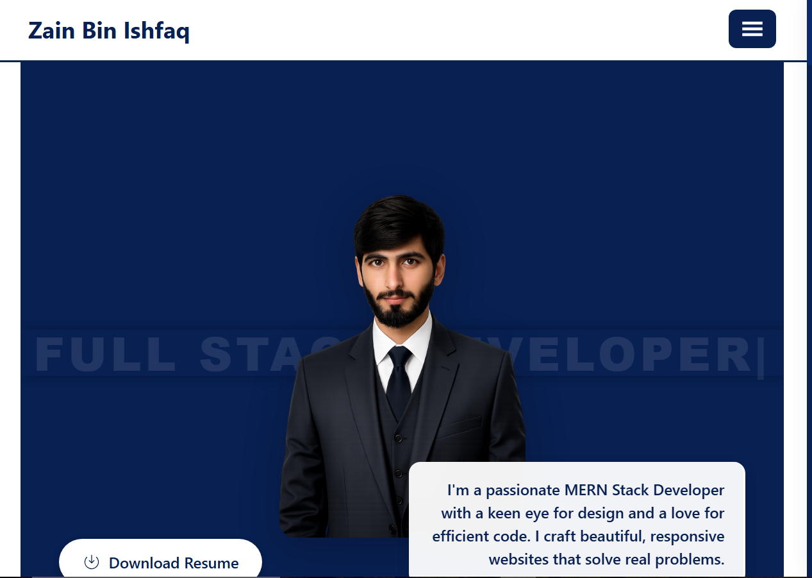

# 💼 My Portfolio – MERN Stack Developer Portfolio

A modern, responsive portfolio website showcasing my skills, projects, and experience as a MERN Stack Developer. Built with React, Tailwind CSS, and Vite.



## 🌐 Live Demo

- **Portfolio:** [https://your-portfolio-url.vercel.app]

## ✨ Features

### 🎨 Design & UI
- Modern and clean design with gradient accents
- Fully responsive for all devices (mobile, tablet, desktop)
- Smooth animations and transitions
- Interactive typing effect on hero section
- Custom scrollbar styling
- Professional color scheme

### 📄 Sections
- **Hero Section** – Profile image with typing effect and call-to-action
- **About Me** – Personal introduction and skill breakdown
- **Projects** – Grid display of projects with detailed views
- **Project Details** – In-depth project information with tech stack
- **Contact** – Contact form with EmailJS integration
- **Tech Stack** – Visual display of technologies used

### 🛠️ Interactive Features
- Download resume functionality
- Project filtering and search
- Social media integration (GitHub, LinkedIn, Email)
- Contact form with email sending capability
- Smooth navigation with React Router

## 🛠️ Tech Stack

### Frontend
| Technology | Description |
|------------|-------------|
| React 18 | UI Library |
| Vite | Build Tool |
| Tailwind CSS | Styling Framework |
| React Router v6 | Routing |
| React Icons | Icon Library |
| Lucide React | Icon Library |
| Typed.js | Typing Animation |
| EmailJS | Email Service |

### Tools & Services
| Tool | Purpose |
|------|---------|
| GitHub | Version Control & Project Hosting |
| Vercel | Hosting & Deployment |
| EmailJS | Contact Form Email Service |

## 📁 Project Structure

```
MyPortfolio/
├── src/
│   ├── assets/                      # Images & static assets
│   │   ├── projects/               # Project screenshots
│   │   │   ├── ecommerce.png
│   │   │   ├── devblog.png
│   │   │   ├── decodelab.png
│   │   │   └── login.png
│   │   └── hero.png                # Profile image
│   ├── components/                  # Reusable components
│   │   ├── common/                 # Common components
│   │   ├── layout/                 # Layout components
│   │   │   ├── AppLayout.jsx
│   │   │   ├── Footer.jsx
│   │   │   └── Navbar.jsx
│   │   └── sections/               # Section components
│   │       ├── Hero.jsx
│   │       ├── ProjectCard.jsx
│   │       └── TechStack.jsx
│   ├── data/                        # Data files
│   │   └── portfolioData.js        # Projects & personal info
│   ├── pages/                       # Page components
│   │   ├── Home.jsx
│   │   ├── About.jsx
│   │   ├── Projects.jsx
│   │   ├── ProjectDetails.jsx
│   │   ├── Contact.jsx
│   │   └── ErrPage.jsx
│   ├── App.jsx                      # Main App component
│   ├── main.jsx                     # Entry point
│   └── index.css                    # Global styles
├── public/                          # Public assets
│   └── Zain_Bin_Ishfaq_Resume.pdf  # Resume file
├── .env                             # Environment variables
├── index.html
├── package.json
├── tailwind.config.js
├── postcss.config.js
└── vite.config.js
```

## 🚀 Getting Started

### Prerequisites
- Node.js (v14 or higher)
- npm or yarn

### Installation

1. **Clone the repository**
```bash
git clone https://github.com/binishfaq/Zain-Bin-Ishfaq-Portfolio
cd MyPortfolio
```

2. **Install dependencies**
```bash
npm install
```

3. **Create `.env` file**
```env
VITE_EMAILJS_SERVICE_ID=*************
VITE_EMAILJS_TEMPLATE_ID=*************
VITE_EMAILJS_PUBLIC_KEY=*************
```

4. **Start development server**
```bash
npm run dev
```

5. **Build for production**
```bash
npm run build
```

## 🎯 Future Improvements

- [ ] Dark/Light mode toggle
- [ ] Blog section integration
- [ ] Project search and filter
- [ ] Animated skill bars
- [ ] Testimonials section
- [ ] Achievement counter
- [ ] Improved SEO
- [ ] Performance optimization

## 📱 Responsive Design

| Device | Breakpoint | Layout |
|--------|------------|--------|
| Mobile | < 480px | Single column |
| Tablet | 481px - 768px | Two columns |
| Desktop | 769px - 1024px | Three columns |
| Large | > 1024px | Four columns |

## 🎨 Color Palette

| Color | Hex | Usage |
|-------|-----|-------|
| Dark Blue | `#082052` | Primary brand color |
| Medium Blue | `#0a2a6e` | Hover states |
| white | `#ffff` | Background |
| White | `#ffffff` | Text on dark backgrounds |
| Dark Gray | `#1a1a1a` | Body text |

## 🤝 Contributing

Contributions are welcome! Please feel free to submit a Pull Request.

1. Fork the repository
2. Create your feature branch (`git checkout -b feature/AmazingFeature`)
3. Commit your changes (`git commit -m 'Add some AmazingFeature'`)
4. Push to the branch (`git push origin feature/AmazingFeature`)
5. Open a Pull Request

## 📄 License

This project is licensed under the MIT License - see the [LICENSE](LICENSE) file for details.

## 👨‍💻 Author

**Zain Bin Ishfaq**

- GitHub: [@binishfaq](https://github.com/binishfaq)
- LinkedIn: [zainbinishfaq](https://linkedin.com/in/zainbinishfaq)
- Email: zainbinishfaq@gmail.com

## 🙏 Acknowledgments

- [React](https://reactjs.org/)
- [Vite](https://vitejs.dev/)
- [Tailwind CSS](https://tailwindcss.com/)
- [React Router](https://reactrouter.com/)
- [Lucide Icons](https://lucide.dev/)
- [React Icons](https://react-icons.github.io/react-icons/)
- [Typed.js](https://github.com/mattboldt/typed.js/)
- [EmailJS](https://www.emailjs.com/)

---

### ⭐ Show Your Support

If you like this project, please give it a star on GitHub! ⭐

Made with ❤️ by [Zain Bin Ishfaq](https://github.com/binishfaq)